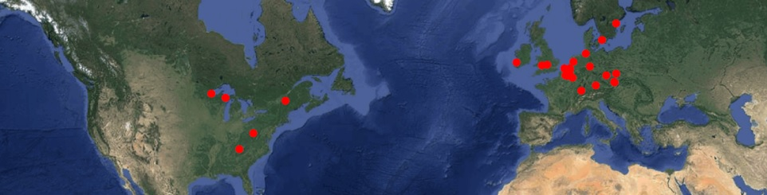

<!-- badges: start -->
[](https://github.com/Pakillo/rSDM/actions/workflows/R-CMD-check.yaml)
[](http://hits.dwyl.com/Pakillo/rSDM)
<!-- badges: end -->

https://pakillo.github.io/rSDM/



To install:

```{r eval=FALSE}
install.packages("rSDM", repos = c("https://pakillo.r-universe.dev", "https://cloud.r-project.org"))
```

