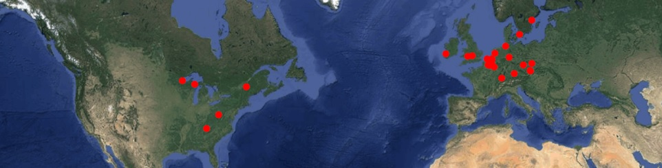

rSDM: Species distribution and niche modelling in R
================
Francisco Rodriguez-Sanchez

<!-- badges: start -->

[](https://github.com/Pakillo/rSDM/actions/workflows/R-CMD-check.yaml)
[](http://hits.dwyl.com/Pakillo/rSDM)
<!-- badges: end -->

<https://pakillo.github.io/rSDM/>



To install:

``` r
remotes::install_github("Pakillo/rSDM")
```
